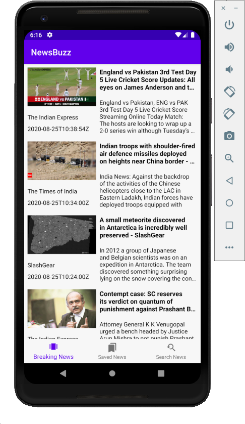

# NewsBuzz

This is a simple single screen app which shows the breaking news fetched from a public API.

# Overview

  - Min SDK - 19
  - Fetches Breaking news from public API - newsApi.org
  - While fetching, display loading animation
  - The app handles configuration changes (like rotation)
  - User can search news based on a keyword
  - Ability to save/favorite the news
  - Ability to delete/Undo the item from saved news
  - Ability to click on a list item to show its content on a webview

## Todos
  - 100% offline support. Once the data is fetched successfully from remote, ability to store locally and serve from cache thereafter till the cache is not expired
  - Pull to refresh to fetch data
  - 100% offline support - right now the app throws a toast message if no internet is available. Should listen to internet changes
  - Unit Testing and UI Testing
  - Dagger/Koin Implementation
  - Automate the app to fetch new data after the cache gets expired in 2 hrs

### Tech
* Android Architecture components
    * MVVM
    * Kotlin
    * Coroutines
    * LiveData
    * Repository Pattern
    * Glide
    * Room database
    * Retrofit
    * Pagination

### Screens

| | |  |  |
|:---:|:---:|:---:|:---:|

### Credits
[Philipp Lackner's MVVM News App Playlist](https://www.youtube.com/playlist?list=PLQkwcJG4YTCRF8XiCRESq1IFFW8COlxYJ)

License
----

MIT

